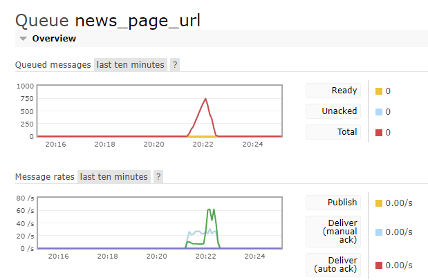
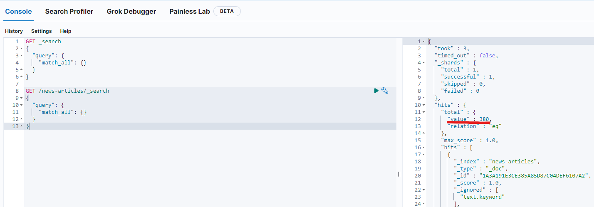

# Домашнее Задание (ИПиАД)

## Задание № 1. Создание робота для сбора публикаций c сайта(crawler) 
### Задание
- [x] Выбрать произвольный сайт (возможно RSS-ленту)
  - Был выбран сайт https://lenta.ru
- [x] Скачать HTML/XML-страницы
- [x] Обработать HTTP-коды ошибок
- [x] Парсить текст публикации с
  - [x] заголовком
  - [x] временем публикации
  - [x] автором
  - [x] ссылкой

### Результат
Объекты класса `NewsArticle`. Пример документа:
```JSON
{
  "title": "Популярная пляжная страна Азии запустит прямые рейсы в Россию",
  "date": "16:15, 14 июня 2023",
  "text": "Мьянма запустит прямое авиасообщение с Россией уже в июле 2023 года. Об этом РИА Новости рассказал вице-премьер и министр внешнеэкономических связей популярной пляжной страны Азии Кан Зо на полях Петербургского международного экономического форума (ПМЭФ).\n\nПо словам главы ведомства, первый прямой рейс между государствами выполнит авиаперевозчик Myanmar Airways International. Полеты будут осуществляться раз в неделю из Янгона и Мандалая в Москву и Новосибирск.\n\nКан Зо отметил, что россиян очень ждут в Мьянме. «Скоро мы презентуем программу Russia Friendship Program (\"Программа дружбы с Россией\" — прим. \"Ленты.ру\"), — заявил он. — Ее представлением занимается наше министерство туризма. Эта программа будет включать в себя организацию туризма из России в Мьянму».\n\nБолее того, вице-премьер подчеркнул, что Мьянма надеется на принятие российскими властями решения об упразднении виз для мьянманцев в качестве ответного жеста. Для россиян они были отменены с 2022 года.\n\nРанее в июне власти Шри-Ланки захотели ввести бесплатные визы для туристов. Об этом заявил посол популярной курортной страны Азии в РФ Джанита Лиянаге. Дипломат добавила, что ланкийский министр туризма усердно занимается этим вопросом.\n\n",
  "author": "Фариза Бацазова",
  "url": "https://lenta.ru/news/2023/06/14/myanmar/"
}
```

## Задание № 2. Использование очередей
### Задание
- [x] Использовать брокер сообщений RabbitMQ
- [x] Создать очереди
  - [x] с задачами (ссылками со стартовой страницы) в программе
  - [x] с результатами (текст публикации, заголовок, дата и т.д.)
  - Были созданы очереди:
    - задач обработки сводок (страниц формата `https://lenta.ru/parts/news/<number>`)
    - задач обработки новостных страниц (страниц формата `https://lenta.ru/news/<date>/<title`)
    - задач индексации распарсенных страниц
- [x] Уметь использовать Basic.Consume и Basic.Get (понимать разницу)
  - `Basic.Consume` - клиент сообщает о готовности, сервер высылает задачи, по мере их появления
  - `Basic.Get` - клиент периодически запрашивает у сервера задачи

### Результат
Программа работает с использованием очередей. Скриншоты из WEB-интерфейса RabbitMQ:\
До запуска программы:\
\
До завершения программы:\
\
Очередь news_page_url:\
\
Очередь process_news_url:\
\
Очередь start_page_url:\


## Задание № 3. Сохранение данных в базу данных ElasticSearch
### Задание
- [x] Использовать базу ElasticSearch
- [x] Создать индекс для хранения документов с соответствующими полями (заголовок, время публикации, текст, ссылка, автор)
- [x] В планировщике (при парсинге стартовой страницы) сохранять с идентификаторами, вычисленными как хэш от заголовка и даты документа (или хэш от ссылки на страницу с новостью)
- [x] Проверять наличие в базе документа по идентификатору (хеш) - не пускать в обработку если уже существует
  - Проверкой занимается сам сервер, при передаче Bulk-запроса по хэш-коду 
- [x] Считывать документы из очереди с результатами и обновлять их в базе по идентификатору (хэш от заголовка и даты документа)
  - Обновлять - невозможно, т. к. если не меняется id - то по п. 4 его нельзя пускать в обработку. Если меняется - то это другой документ с другим id. 
- [x] Выполнять поиск по нескольким полям документа в разных комбинациях (с различными логическими операторами)
- [x] Уметь составлять сложные полнотекстовые поисковые запросы (понимать синтаксис полнотекстового поиска ElasticSearch)
- [x] Выполнять различные типы агрегаций (например вывод гистограммы по количеству публикаций на различные даты и для различных авторов)

### Результат
Cтатьи хранятся в базе данных ElasticSearch\
\
Гистограмма по дате публикации:\
\
Круговая диаграмма по авторам:\


#### Примеры запросов
Получить все данные:
```json
GET /news-articles/_search
{
  "query": {
    "match_all": {}
  }
}
```
Получить все статьи за авторством Майи или Дарьи:
```json
GET /news-articles/_search
{
  "query": {
    "match": {
      "author": "Майя Дарья"
    }
  }
}
```
Получить все статьи в которых "Майя" содержится в поле "автор" или "заголовок":
```json
GET /news-articles/_search
{
  "query": {
    "multi_match": {
      "query": "Майя",
      "fields": ["author", "title"]
    }
  }
}
```
Получить все статьи за авторством Майи Пономаренко:
```json
GET /news-articles/_search
{
  "query": {
    "multi_match": {
      "query": "Майя Пономаренко",
      "fields": ["author"],
      "operator": "and"
    }
  }
}
```

## Задание № 4. Анализ собранных данных
### Задание
- [ ] Поиск неполных дублей с предварительной фильтрацией текста: использование регулярок, Long Sent, Heavy Sent – удовл.
- [ ] Поиск неполных дублей: TF-IDF, Lex Rand, shingles, – хор.
- [ ] Поиск неполных дублей: Megashingles,Shingles+MinHash, Word2Vec+MinHash и др. на базе MinHash – отл.
- [ ] Кластеризация, классификация – отл
- [ ] Выявление сущностей  – отл.
- [x] Определение тональности – отл.
- [ ] Любые алгоритмы с использованием нейросети и предварительным обучением по вашим накопленным данным – отл.

### Результат 
- Написана дополнительная программа-анализатор - https://github.com/CheerfulGrape/isada-analyze
- Добавлено поле `tonality`

Поле tonality:\
\
Графики с новым полем:\
\
График позволяет сделать вывод, что хотя в большинстве своём статьи окрашены нейтрально, как и подобает новостному ресурсу, иногда появляются статьи с ярким окрасом (тональность "-13").